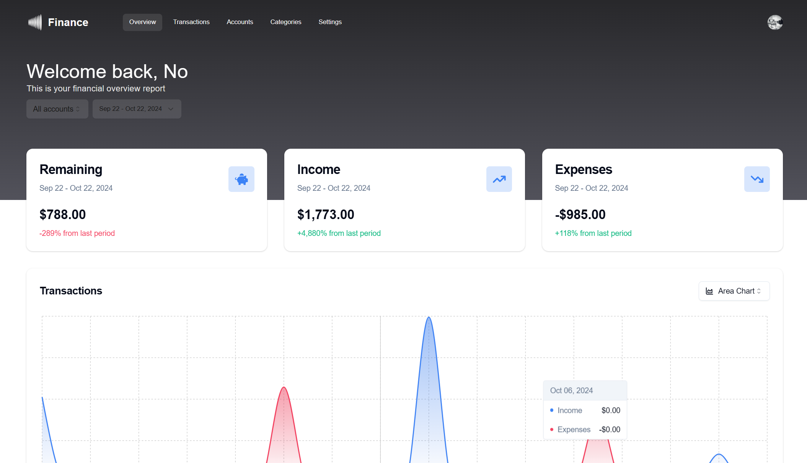
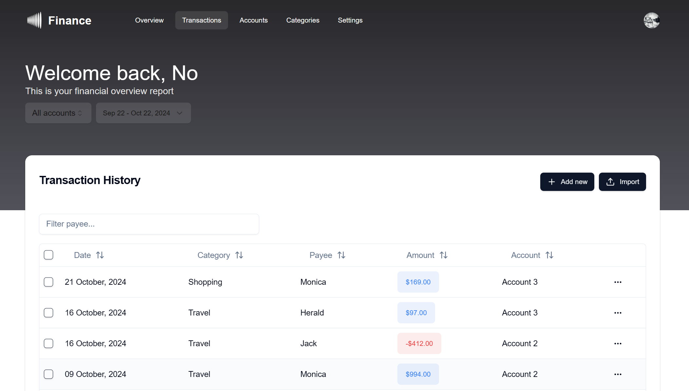

# Finance Platform

This is a finance NextJs project platform. Platform allows to keep track of transactions and see statistical representation of your financial data.

# Demo

<p align="center">
  
</p>
<p align="center">
  
</p>
<h2 align="center">
  <a href="https://https://finance-platform-dun.vercel.app/">Demo</a>
</h2>

# About

The Finance Platform app emulates the functionality of transaction management services. Users can add, edit, and delete transactions, accounts, and categories. Transactions and category data is visualized by different charts. API is written in HonoJS. The database is handled by NeonDB Postgres. Data fetching is handled by a TanStack (React) Query.

# Features

- Overview, transactions, accounts, categories, sign-in, sign-up pages
- Authorization
- Transactions, accounts, categories filtering (by date, account) and searching
- Transactions, accounts, categories sorting
- Adding and editing, deleting transactions, accounts, and categories
- Pagination
- CSV importing of transactions
- Transactions and categories data visualization
- Responsive design

# Tech Stack

- **Authorization**: Clerk
- **Backend APIs**: HonoJS
- **Charts**: Reacharts
- **Database platform**: Neon Serverless (Posrgres)
- **Forms**: React Hook Form
- **Frontend framework**: NextJS
- **ORM**: Drizzle
- **Styles**: TailwindCSS, shadcn/ui
- **State Management**: Tanstack Query, Zustand
- **Dependencies**:
  - date-fns
  - react-select
  - react-use
  - tanstack table
  - zod

## Run Locally

Clone the project

```bash
git clone https://github.com/osp-d/finance-platform
```

Go to the project directory

```bash
cd finance-platform
```

Install dependencies

```bash
npm install
```

Start the server

```bash
npm run dev
```
